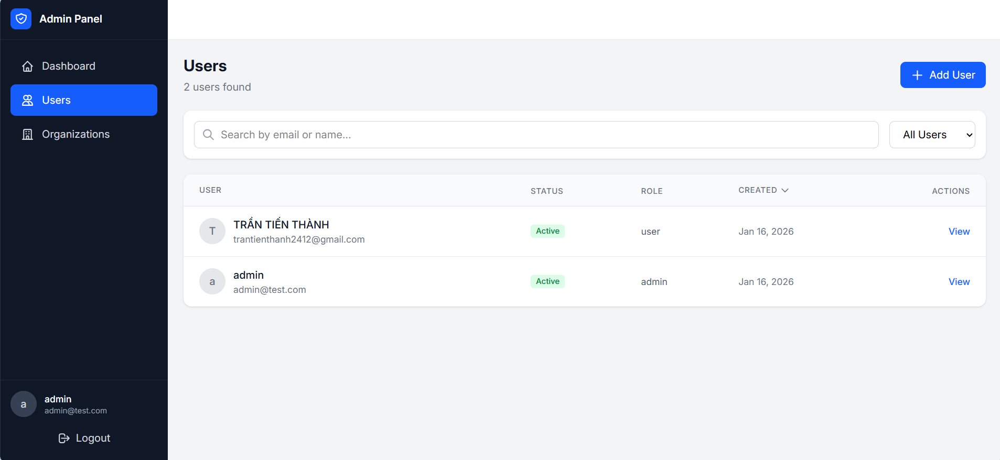

# better-auth-admin

Admin Dashboard for [Better Auth](https://better-auth.com) - Manage users, organizations, and sessions with a beautiful, modern UI.


## 🚀 Quick Start

Add an admin dashboard to your Express app in **3 lines of code**:

```typescript
import express from "express";
import { betterAuthAdmin } from "better-auth-admin";

const app = express();

app.use(
  "/admin",
  betterAuthAdmin({
    authUrl: "http://localhost:3000",
  })
);

app.listen(3000);
// Admin dashboard: http://localhost:3000/admin 🎉
```

That's it! Your admin dashboard is now available at `/admin`.

### UI




---

## ✨ Features

- 👥 **User Management**: View, create, edit, ban/unban users
- 🏢 **Organization Management**: Manage organizations, members, and invitations
- 🔐 **Session Management**: View and revoke user sessions
- 🎨 **Modern UI**: Built with React and Tailwind CSS
- 🔒 **Secure**: Only accessible to authenticated admin users

## 📦 Installation

```bash
npm install better-auth-admin
# or
pnpm add better-auth-admin
# or
yarn add better-auth-admin
```

---

## 📋 Prerequisites & Setup

Before using the dashboard, you need to configure Better Auth with the admin plugin.

### Step 1: Configure Better Auth Admin Plugin

First, make sure you have Better Auth set up in your project. Then configure the **admin plugin**:

```typescript
// auth.ts
import { betterAuth } from "better-auth";
import { admin, organization } from "better-auth/plugins";

export const auth = betterAuth({
  database: {
    // your database config
  },
  emailAndPassword: {
    enabled: true,
  },
  plugins: [
    admin({
      defaultRole: "user",
      adminRole: "admin",
      // Add your admin user ID here (see Step 3)
      adminUserIds: ["your-admin-user-id"],
    }),
    organization(), // Optional: enable organization management
  ],
});
```

### Step 2: Create Your Admin Account

Create a user account using Better Auth's standard signup API:

```typescript
// Using the client SDK
import { createAuthClient } from "better-auth/client";

const authClient = createAuthClient({
  baseURL: "http://localhost:3000",
});

// Sign up a new account
await authClient.signUp.email({
  email: "admin@example.com",
  password: "your-secure-password",
  name: "Admin User",
});
```

Or via API request:

```bash
curl -X POST http://localhost:3000/api/auth/sign-up/email \
  -H "Content-Type: application/json" \
  -d '{"email":"admin@example.com","password":"your-secure-password","name":"Admin User"}'
```

### Step 3: Update User Role in Database

After creating your account, you need to set the user's role to "admin" in your database:

**For SQLite/PostgreSQL/MySQL:**

```sql
-- Find your user ID first
SELECT id, email, role FROM user;

-- Update the role to admin
UPDATE user SET role = 'admin' WHERE email = 'admin@example.com';
```

**Using Drizzle ORM:**

```typescript
import { db } from "./db";
import { user } from "./db/schema";
import { eq } from "drizzle-orm";

await db
  .update(user)
  .set({ role: "admin" })
  .where(eq(user.email, "admin@example.com"));
```

**Using Prisma:**

```typescript
await prisma.user.update({
  where: { email: "admin@example.com" },
  data: { role: "admin" },
});
```

### Step 4: Add Admin User ID to Config

Copy the user ID from Step 3 and add it to your Better Auth config:

```typescript
// auth.ts
export const auth = betterAuth({
  // ... other config
  plugins: [
    admin({
      defaultRole: "user",
      adminRole: "admin",
      adminUserIds: ["QRWWFp9Vs20Na7sgKJbazYvpcaiK3Ane"], // Your admin user ID
    }),
    // ...
  ],
});
```

> **Note:** The `adminUserIds` array allows multiple admin users. These users will always have admin access regardless of the database role.

### Step 5: Mount the Dashboard

Add the admin dashboard to your Express server:

```typescript
// server.ts
import express from "express";
import { betterAuthAdmin } from "better-auth-admin";

const app = express();

// Your Better Auth API handler
app.all("/api/auth/*", (req, res) => auth.handler(req, res));

// Mount admin dashboard at /admin
app.use(
  "/admin",
  betterAuthAdmin({
    authUrl: "http://localhost:3000", // Your Better Auth server URL
  })
);

app.listen(3000, () => {
  console.log("Server running at http://localhost:3000");
  console.log("Admin dashboard at http://localhost:3000/admin");
});
```

## 📖 Configuration Options

| Option    | Type     | Required | Default               | Description                             |
| --------- | -------- | -------- | --------------------- | --------------------------------------- |
| `authUrl` | `string` | ✅       | -                     | The base URL of your Better Auth server |
| `title`   | `string` | ❌       | `"Better Auth Admin"` | Custom title for the dashboard          |

## 📂 Complete Example

Here's a complete example with Express, Drizzle, and SQLite:

```typescript
// src/index.ts
import express from "express";
import { betterAuth } from "better-auth";
import { drizzleAdapter } from "better-auth/adapters/drizzle";
import { admin, organization } from "better-auth/plugins";
import { betterAuthAdmin } from "better-auth-admin";
import { db, schema } from "./db";

// Configure Better Auth
const auth = betterAuth({
  database: drizzleAdapter(db, {
    provider: "sqlite",
    schema,
  }),
  emailAndPassword: {
    enabled: true,
  },
  plugins: [
    admin({
      defaultRole: "user",
      adminRole: "admin",
      adminUserIds: ["your-admin-user-id"],
    }),
    organization(),
  ],
});

// Create Express app
const app = express();
app.use(express.json());

// Better Auth API handler
app.all("/api/auth/*", (req, res) => auth.handler(req, res));

// Mount admin dashboard
app.use(
  "/admin",
  betterAuthAdmin({
    authUrl: process.env.AUTH_URL || "http://localhost:3000",
    title: "My App Admin",
  })
);

// Start server
app.listen(3000, () => {
  console.log("🚀 Server: http://localhost:3000");
  console.log("📊 Admin:  http://localhost:3000/admin");
});
```

## 🔐 Security Notes

- The dashboard is protected by Better Auth's admin plugin
- Only users with the "admin" role OR listed in `adminUserIds` can access admin features
- The dashboard uses cookies for authentication - make sure your `trustedOrigins` is properly configured
- For production, always use HTTPS and configure CORS properly

## 🛠️ Requirements

- Node.js 18+
- Express.js 4.x or 5.x
- Better Auth with admin plugin enabled

## 📄 License

MIT

## 🤝 Contributing

Contributions are welcome! Please open an issue or submit a pull request.

## 📞 Support

- [GitHub Issues](https://github.com/Tranthanh98/better-auth-dashboard/issues)
- [Better Auth Documentation](https://better-auth.com)
